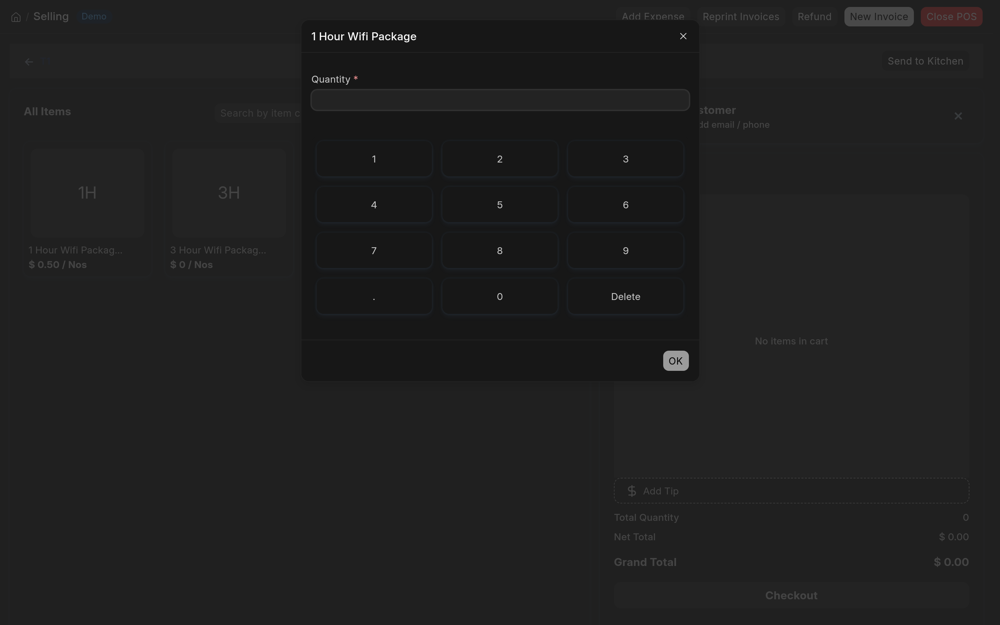

# Awesome Butchery

**Augmentations to ERPNext POS for a butchery workflow**

[](https://opensource.org/licenses/MIT)
[](https://github.com/Stelele/awesome-butchery)
[](https://frappe.io)

> Extend your ERPNext Point of Sale with butchery-specific features — primarily a quick quantity dialog for POS items.

---

## Table of Contents

1. [Installation](#installation)
2. [Setup](#setup)
3. [Usage](#usage)
4. [Configuration](#configuration)
5. [Troubleshooting / FAQ](#troubleshooting--faq)
6. [Contributing](#contributing)
7. [License](#license)

---

### Screenshots

The Quick Quantity numpad dialog (enabled per POS Profile):



## Installation

### Via Bench CLI

```bash
# From your bench directory
bench get-app https://github.com/Stelele/awesome-butchery --branch version-16
bench --site <site_name> install-app awesome_butchery
```

### Via Frappe Cloud

1. Go to **Settings > Frappe Cloud** in your site admin
2. Click **Add App from GitHub**
3. Enter: `Stelele/awesome-butchery`
4. Select branch `version-16`
5. Click **Install** on the app card
6. The app will be installed on your selected site

### Development Install (local)

```bash
bench init --skip-redis-config-generation --skip-assets --python "$(which python)" ~/frappe-bench
bench --site <site_name> set-config developer_mode 1
bench get-app https://github.com/Stelele/awesome-butchery --branch version-16
bench --site <site_name> install-app awesome_butchery
bench build
```

---

## Setup

1. **Enable the feature** — open any POS Profile and check the **Quick Quantity Dialog** checkbox.
2. **Custom field created** — the app adds a `Quick Quantity Dialog` field (Check type) to the POS Profile doctype. This field is inserted after `auto_add_item_to_cart`.
3. **Cache clear** — after migration, run `bench --site <site_name> clear-cache` if the custom field does not appear; `frappe.clear_cache(doctype="POS Profile")` is Python code and must be run inside `bench --site <site_name> console`. After saving a POS Profile, **reload or reopen the POS screen** — the setting is read when the POS opens, and an already-open POS does not pick it up.

> The custom field `show_quantity_dialog` is defined in `awesome_butchery/migrate.py` and `awesome_butchery/fixtures/custom_field.json`. It appears on the POS Profile form and controls whether clicking an item in the POS opens a quantity dialog instead of auto-adding qty=1.

---

## Usage

### Quick Quantity Dialog

When "Quick Quantity Dialog" is enabled on a POS Profile:

| Action | Before (default) | After (enabled) |
|---|---|---|
| Click item in POS | Auto-adds qty=1 to cart | Quantity dialog opens |
| Dialog type | N/A | NumberPad-style input with OK/Cancel |
| Quantity input | N/A | Free-text or numpad buttons |
| Default qty | 1 | Blank — or the current cart row qty if the item is already in the cart |

**Flow:**
1. Customer clicks an item on the POS screen
2. A dialog opens with the ERPNext NumberPad for quantity entry
3. User enters quantity and clicks **OK**
4. The item is added to the cart with the specified quantity

> **Note:** Empty or non-positive quantities (e.g. `0`, `-1`) are rejected — **OK** stays disabled until a quantity greater than 0 is entered, and pressing **Enter** with an invalid quantity does nothing.

### Configuring POS Profile

1. Navigate to **Point of Sale > Setup > POS Profile**
2. Edit or create a POS Profile
3. Check **Quick Quantity Dialog**
4. Save — then **reload/reopen the POS screen**; the change takes effect on the next POS session (not on a POS that is already open)

---

## Configuration

The app configures one custom field:

| Field | DocType | Fieldname | Type | Default | Description |
|---|---|---|---|---|---|
| Quick Quantity Dialog | POS Profile | `show_quantity_dialog` | Check | `0` (unchecked) | When checked, clicking an item in the POS opens a quantity dialog instead of auto-adding qty=1 |

**Field details:**
- `insert_after`: `auto_add_item_to_cart`
- The full attribute set — `translatable`, `permlevel`, `module`, `is_system_generated`, `hidden` — is defined in `awesome_butchery/fixtures/custom_field.json`
- `migrate.py` `after_migrate()` passes `fieldname`, `fieldtype`, `label`, `default`, `insert_after`, `description`, and `translatable`; the fixture additionally supplies `doctype`, `name`, `dt`, `permlevel`, `module`, `is_system_generated`, and `hidden`

No other configuration settings are required. The feature is purely toggle-driven via the POS Profile checkbox.

---

## Troubleshooting / FAQ

| Issue | Cause | Resolution |
|---|---|---|
| Dialog doesn't open after enabling the checkbox | POS cache not cleared | Run `bench build` or `bench --site <site_name> clear-cache`. (`frappe.clear_cache(doctype="POS Profile")` is Python code — run it inside `bench --site <site_name> console`) |
| NumberPad not loading | ERPNext PointOfSale not loaded | Ensure you're on ERPNext v16 with Point of Sale enabled |
| Dialog opens but numpad keys don't respond | JavaScript conflict | Check for other apps that modify `erpnext.PointOfSale.ItemSelector` |
| Field not visible on POS Profile | Custom field not synced | Run `bench migrate` or clear cache and reload the form |

### How to disable

Uncheck **Quick Quantity Dialog** on the POS Profile and save. The feature reverts to auto-adding qty=1.

---

## Contributing

1. Fork the repository
2. Create a feature branch: `git checkout -b feature/amazing-feature`
3. Commit your changes: `git commit -m "feat: add amazing feature"`
4. Push to branch: `git push origin feature/amazing-feature`
5. Open a Pull Request

### Development setup

Complete the [Development Install (local)](#development-install-local) first, then run the tests:

```bash
bench --site test_site set-config allow_tests true
bench --site test_site run-tests --app awesome_butchery
```

### Code style

This app uses `pre-commit` with the following tools:
- **ruff** — Python linting and formatting
- **eslint** — JavaScript linting
- **prettier** — Code formatting

Run pre-commit locally:

```bash
cd apps/awesome_butchery
pre-commit install
pre-commit run --all-files
```

### Running CI locally

The GitHub Actions CI requires Docker (MariaDB, Redis). See `.github/workflows/ci.yml` for the full pipeline.

---

## License

**MIT License**

Copyright (c) 2026 Gift Mugweni

Permission is hereby granted, free of charge, to any person obtaining a copy
of this software and associated documentation files (the "Software"), to deal
in the Software without restriction, including without limitation the rights
to use, copy, modify, merge, publish, distribute, sublicense, and/or sell
copies of the Software, and to permit persons to whom the Software is
furnished to do so, subject to the following conditions:

The above copyright notice and this permission notice shall be included in all
copies or substantial portions of the Software.

THE SOFTWARE IS PROVIDED "AS IS", WITHOUT WARRANTY OF ANY KIND, EXPRESS OR
IMPLIED, INCLUDING BUT NOT LIMITED TO THE WARRANTIES OF MERCHANTABILITY,
FITNESS FOR A PARTICULAR PURPOSE AND NONINFRINGEMENT. IN NO EVENT SHALL THE
AUTHORS OR COPYRIGHT HOLDERS BE LIABLE FOR ANY CLAIM, DAMAGES OR OTHER
LIABILITY, WHETHER IN AN ACTION OF CONTRACT, TORT OR OTHERWISE, ARISING FROM,
OUT OF OR IN CONNECTION WITH THE SOFTWARE OR THE USE OR OTHER DEALINGS IN THE
SOFTWARE.